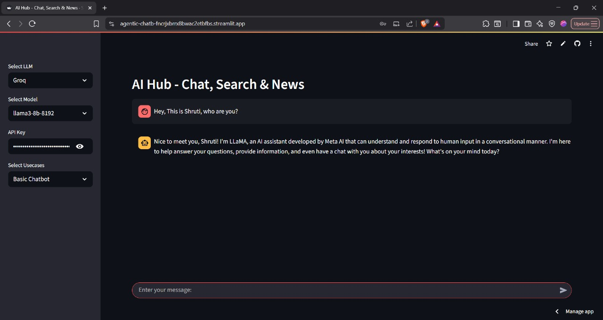
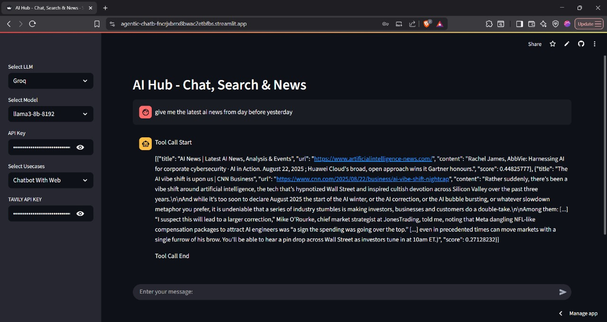
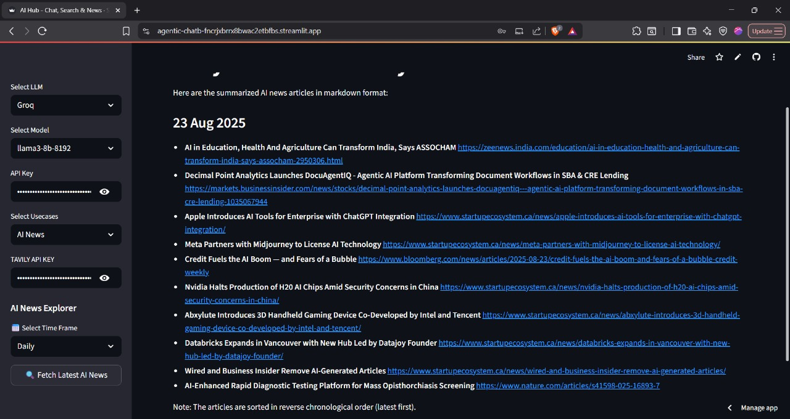

# Agentic Chatbot

A multi-tier chatbot system built with LangGraph demonstrating progressive AI architecture complexity from basic conversational interfaces to advanced agentic workflows with automated news summarization.

[](https://www.python.org/downloads/)
[](https://langchain.com/langgraph)
[](https://streamlit.io)
[](https://groq.com)

## Overview

This project implements modular coding principles in AI development through three progressive implementation tiers, each building upon the previous with increased sophistication and capability.

**🚀 Live Demo**: coming soon

## Architecture

```
TIER 1: BASIC CHATBOT
START → CHATBOT NODE → END

TIER 2: ENHANCED CHATBOT WITH TOOLS  
START → CHATBOT WITH TOOLS → SEARCH TOOL → END

TIER 3: AI NEWS SUMMARIZER
SCHEDULER → FETCH NEWS → SUMMARIZER → SAVE RESULTS → DISPLAY
```

## Implementation Tiers

### Tier 1: Basic Chatbot
Simple conversational interface using LangGraph nodes for basic query-response functionality.


*Basic chatbot interface with simple conversation flow*

```python
from src.langgraphagenticai.nodes.basic_chatbot_node import BasicChatbotNode

chatbot = BasicChatbotNode()
response = chatbot.process("Hello! How are you today?")
```

### Tier 2: Enhanced Chatbot with Tools
Advanced chatbot with external tool integration and search capabilities.


*Enhanced chatbot with tool integration and search functionality*

```python
from src.langgraphagenticai.nodes.chatbot_with_Tool_node import ChatbotWithToolNode

enhanced_bot = ChatbotWithToolNode()
response = enhanced_bot.process("Search for the latest AI news")
```

### Tier 3: AI News Summarizer
Production-ready automated news processing with Tavily API integration for scheduled content generation.


*AI News Summarizer showing automated daily, weekly, and monthly summaries*

```python
from src.langgraphagenticai.nodes.ai_news_node import AINewsNode

news_processor = AINewsNode()
daily_summary = news_processor.generate_daily_summary()
```

## Quick Start

### Prerequisites
- Python 3.13+
- Groq API Key
- Tavily API Key

### Installation

```bash
git clone https://github.com/ParulYadav01/Agentic-Chatbot.git
cd Agentic-Chatbot

conda create -n agentic-chatbot python=3.13
conda activate agentic-chatbot

pip install -r requirements.txt
```

## Project Structure

```
Agentic-Chatbot/
├── src/langgraphagenticai/
│   ├── LLMS/
│   │   └── groqllm.py               # Groq LLM integration
│   ├── graph/
│   │   └── graph_builder.py         # LangGraph workflows
│   ├── nodes/
│   │   ├── basic_chatbot_node.py    # Tier 1 implementation
│   │   ├── chatbot_with_Tool_node.py # Tier 2 implementation
│   │   └── ai_news_node.py          # Tier 3 implementation
│   ├── state/
│   │   └── state.py                 # State management
│   ├── tools/
│   │   └── search_tool.py           # Tavily search integration
│   ├── ui/streamlitui/
│   │   ├── loadui.py               # Main UI
│   │   ├── display_result.py       # Result display
│   │   └── uiconfigfile.ini        # UI configuration
│   └── main.py                     # Application entry
├── AINews/
│   ├── daily_summary.md            # Generated daily summaries
│   ├── weekly_summary.md           # Generated weekly summaries
│   └── monthly_summary.md          # Generated monthly summaries
├── app.py                          # Streamlit application entry
├── requirements.txt
└── .env
```

## API Setup

### Groq API Configuration

1. **Sign up for Groq Cloud**
   - Visit [Groq Cloud](https://console.groq.com/)
   - Create a new account or sign in
   - Navigate to API Keys section
   - Generate a new API key
   - Copy the API key for configuration

2. **Tavily API Configuration**
   - Visit [Tavily](https://tavily.com/)
   - Sign up for a new account
   - Go to API Keys in your dashboard
   - Generate a new API key
   - Copy the API key for news search functionality


## Getting Started

```bash
# Install dependencies
pip install -r requirements.txt

# Run the application
streamlit run app.py
```

Access the application at `http://localhost:8501` and start chatting with your AI assistant that can fetch real-time news and information.


*Live demonstration of the chatbot in action with news search capabilities*

## Support

- **Issues**: [GitHub Issues](https://github.com/ParulYadav01/Agentic-Chatbot/issues)
- **Discussions**: [GitHub Discussions](https://github.com/ParulYadav01/Agentic-Chatbot/discussions)

---

**Built by [Parul](https://github.com/ParulYadav01)** - Demonstrating modular AI development principles
